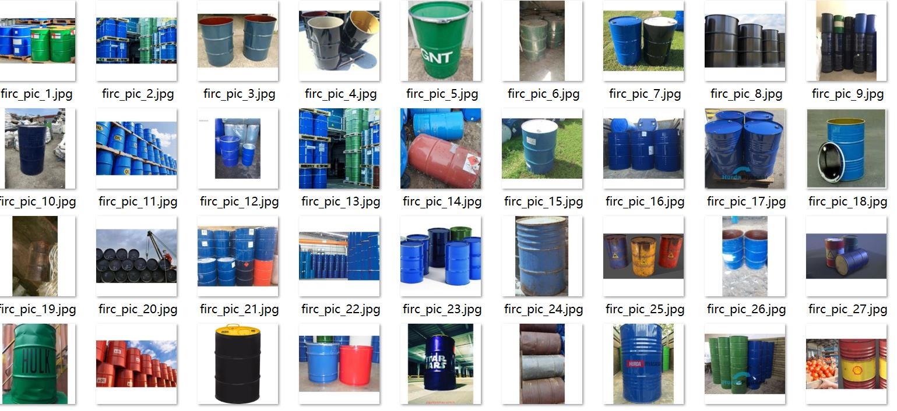
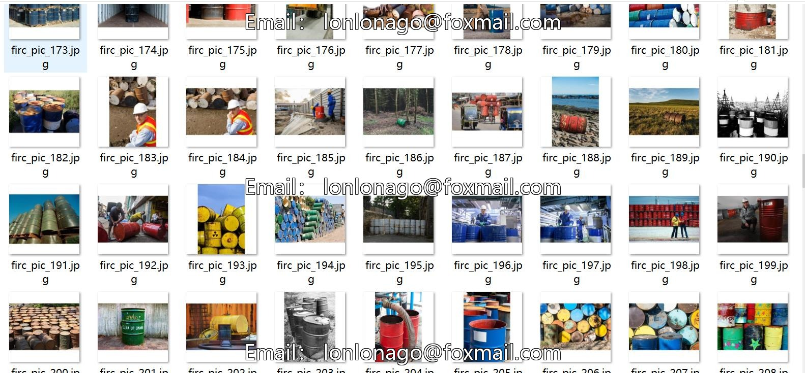
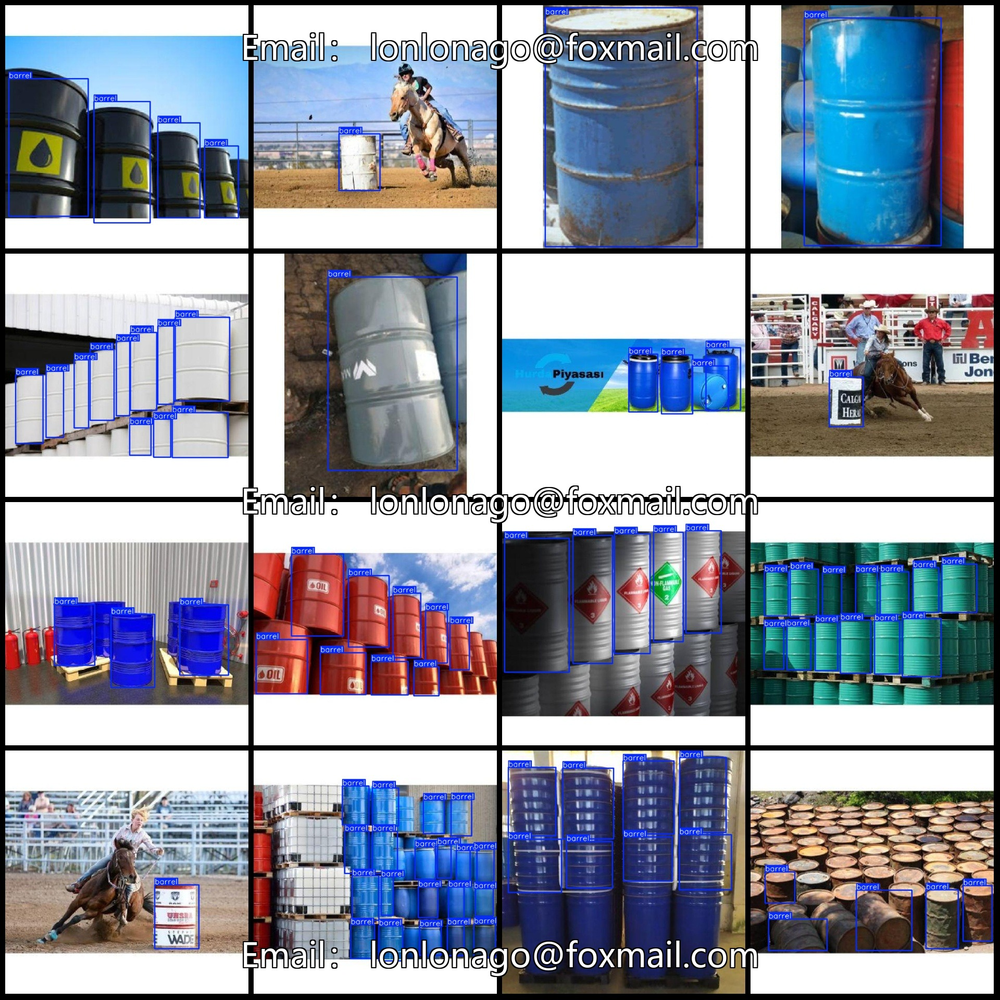
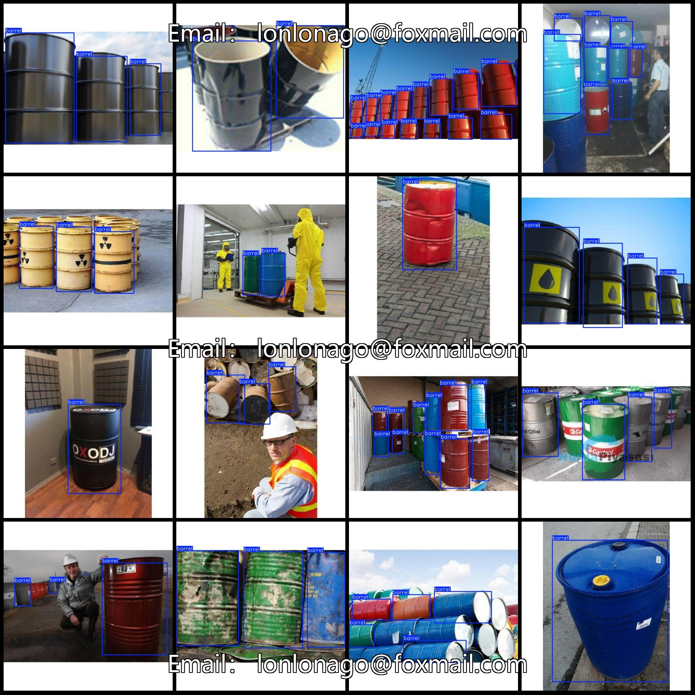

# Oil Tank Detection Dataset: VOC+YOLO Format with 458 Images in One Category

Dataset format: Pascal VOC format + YOLO format (txt file without split path, only containing jpg images along with corresponding VOC format xml files and YOLO format txt files)
Number of images (jpg file count): 458
Number of annotations (xml file count): 458
Number of annotations (txt file count): 458
Number of categories: 1
Annotation category name: ["barrel"]
Number of bounding boxes per category:
barrel = 2358
Total bounding boxes: 2358
Number of images per category:
barrel = 456
Image resolution: 640x640
Annotation tool used: labelImg
Annotation rule: Drawing a rectangle around the category
Important note: The dataset does not include training, validation, or test sets. Please arrange them yourself.
Special statement: This dataset does not guarantee the accuracy of the trained models or weight files.
Image examples:

## Images

Here is a pay link on Stripe ( https://buy.stripe.com/3cs8yP7sY87d0vu9AB ). Please contact me lonlonago@foxmail.com after funding $89, and I will send you a complete data files , thank you!

